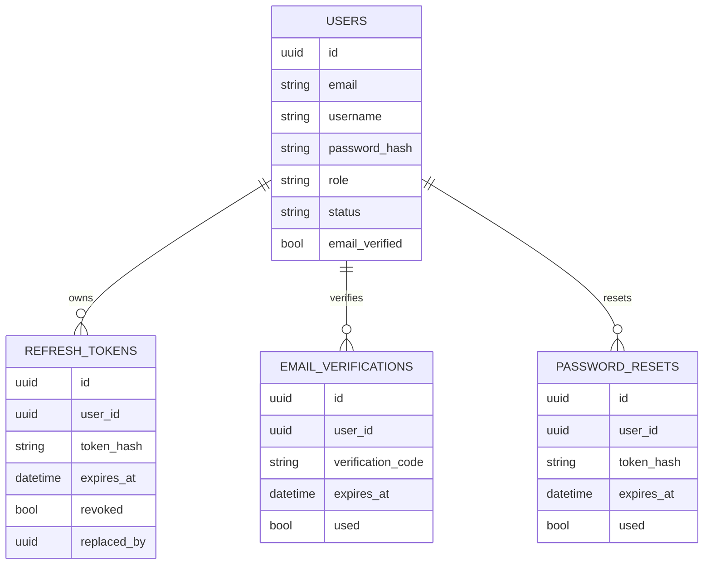
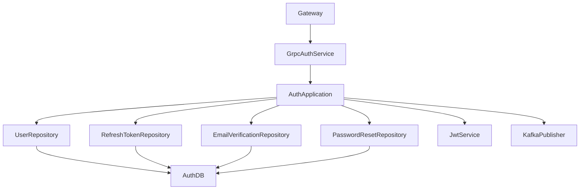
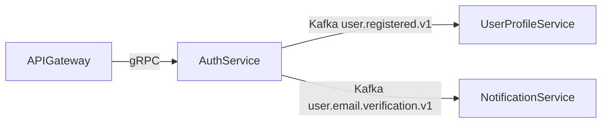

# Auth Service

## Overview
Auth Service is the identity and token authority for the platform. It manages account lifecycle, JWT issuance, refresh-token rotation, and verification workflows.

## Responsibilities
- Register user identities and enforce unique email/username constraints.
- Authenticate credentials and issue access/refresh tokens.
- Rotate and revoke refresh tokens.
- Manage email verification code generation, resend, and verification.
- Publish onboarding and verification events to Kafka.

## Architecture
- Transport layer: `AuthGrpcService` implementing `AuthService` from `proto/auth.proto`.
- Application layer: business logic in auth services (`signup`, `login`, `refresh`, `logout`, verification).
- Persistence layer: JPA repositories with Flyway-managed schema.
- Security layer: RSA-signed JWT via `JwtService`, password hashing with Spring Security.
- Integration layer: Kafka publishers for user registration and email verification notifications.

## API / gRPC Contracts
### gRPC Service
From `proto/auth.proto`:
- `Signup(SignupRequest) returns (AuthResponse)`
- `Login(LoginRequest) returns (AuthResponse)`
- `VerifyEmail(VerifyRequest) returns (SimpleResponse)`
- `ResendVerificationCode(ResendVerificationRequest) returns (SimpleResponse)`
- `RefreshToken(RefreshRequest) returns (AuthResponse)`
- `Logout(LogoutRequest) returns (SimpleResponse)`

### Referenced Contracts
- `proto/auth.proto` for request/response schemas and role enum.

## Communication
- Inbound synchronous: gRPC from api-gateway.
- Outbound asynchronous: Kafka publish to `user.registered.v1` and `user.email.verification.v1`.
- Outbound sync dependencies: none required for core token operations.

## Data Layer
### Database Overview
- PostgreSQL database: `auth_db`.
- Migration strategy: Flyway SQL migrations.

### Entities
- `users`: account identity and security status.
- `refresh_tokens`: token hash, expiry, revocation state, replacement chain.
- `email_verifications`: one-time verification code and usage status.
- `password_resets`: password-reset token records.

### Relationships
- One `users` record has many `refresh_tokens`.
- One `users` record has many `email_verifications`.
- One `users` record has many `password_resets`.

### Database Diagram (MANDATORY)

## Key Workflows
1. Signup: validate identity uniqueness -> persist `users` row -> create verification code -> publish registration/verification events -> return token pair.
2. Login: validate credentials and account state -> issue JWT + refresh token -> persist hashed refresh token.
3. Refresh: validate refresh token hash -> revoke prior token -> issue new token pair.
4. Verification: validate active code -> mark code used -> update `users.email_verified`.

## Service Architecture Diagram (MANDATORY)

## Inter-Service Communication Diagram (MANDATORY)

## Environment Variables
| Name | Purpose | Required |
| --- | --- | --- |
| `SERVER_PORT` | Spring Boot HTTP/management port | No |
| `GRPC_SERVER_PORT` | gRPC listener port | Yes |
| `SPRING_DATASOURCE_URL` | PostgreSQL JDBC URL | Yes |
| `SPRING_DATASOURCE_USERNAME` | PostgreSQL username | Yes |
| `SPRING_DATASOURCE_PASSWORD` | PostgreSQL password | Yes |
| `SPRING_KAFKA_BOOTSTRAP_SERVERS` | Kafka broker list | Yes |
| `APP_GRPC_AUTH_SERVICE_SECRET` | Shared service secret for internal gRPC | Yes |
| `APP_KAFKA_TOPIC_USER_REGISTERED` | Registration event topic | Yes |
| `APP_KAFKA_TOPIC_USER_EMAIL_VERIFICATION` | Verification email event topic | Yes |
| `APP_JWT_ISSUER` | JWT issuer claim value | Yes |
| `APP_JWT_AUDIENCE` | JWT audience claim value | Yes |
| `APP_JWT_ACCESS_EXP_MINUTES` | Access token TTL minutes | No |
| `APP_JWT_REFRESH_EXP_DAYS` | Refresh token TTL days | No |

## Running the Service
- Docker: `docker compose up auth-service postgres kafka`.
- Local: `mvn -f auth-service/pom.xml spring-boot:run`.

## Scaling & Reliability Considerations
- `users.email` and token-hash uniqueness constraints protect identity consistency under concurrency.
- Refresh token rotation prevents replay of old refresh tokens.
- Kafka publish retries and DLT strategy should be used for event durability.
- Horizontal scaling is safe with shared database and deterministic token validation rules.
