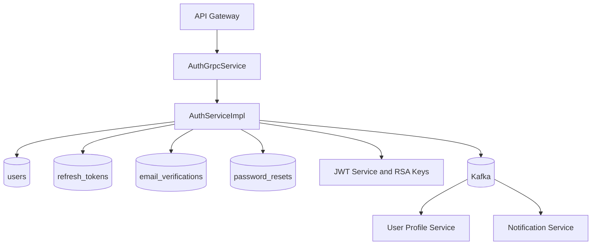

# Auth Service

## Overview
The Auth Service manages identity and session security for the platform. It provides gRPC operations for signup, login, email verification, token refresh, and logout, and publishes integration events for user onboarding and email verification.

## Responsibilities
- Register users and enforce uniqueness for email and username.
- Authenticate users with password verification.
- Issue JWT access tokens and refresh tokens.
- Rotate and revoke refresh tokens.
- Manage verification-code lifecycle for email verification.
- Publish domain events to Kafka for downstream services.

## Architecture
This service is a Spring Boot + Spring Data JPA + Flyway application.

- gRPC transport:
  - `AuthGrpcService` implements `AuthService` RPCs from `proto/auth.proto`.
- Application layer:
  - `AuthServiceImpl` contains business workflows (signup/login/refresh/verify/logout).
- Security layer:
  - `JwtService` signs JWTs using RSA keys under `src/main/resources/keys/`.
  - Password hashing handled by Spring Security password encoder.
- Persistence layer:
  - JPA repositories for users, refresh tokens, email verification, and password reset records.
- Integration layer:
  - Kafka publishers in `service/event/` for user registration and verification-email events.

## API / gRPC Contracts
### Exposed gRPC service
From `proto/auth.proto`:
- `Signup(SignupRequest) -> AuthResponse`
- `Login(LoginRequest) -> AuthResponse`
- `VerifyEmail(VerifyRequest) -> SimpleResponse`
- `ResendVerificationCode(ResendVerificationRequest) -> SimpleResponse`
- `RefreshToken(RefreshRequest) -> AuthResponse`
- `Logout(LogoutRequest) -> SimpleResponse`

### Inbound callers
- Primarily `api-gateway` over gRPC with service metadata (`x-service-secret`, `x-user-id`, correlation id).

## Data Layer
- Database: PostgreSQL (`auth_db`).
- Migration tool: Flyway.
- Core tables:
  - `users`: account identity, status, role, email verification state.
  - `refresh_tokens`: hashed refresh tokens, expiry, revocation, rotation chain.
  - `email_verifications`: one-time verification code and expiry.
  - `password_resets`: password reset token records.
- Relationships:
  - `users` is parent for `refresh_tokens`, `email_verifications`, and `password_resets`.

## Communication
- Sync:
  - gRPC server consumed by `api-gateway`.
- Async:
  - Publishes `user.registered.v1` for profile bootstrap.
  - Publishes `user.email.verification.v1` for notification delivery.

## Key Workflows
1. Signup and onboarding
   - Validate uniqueness of email/username.
   - Persist new user with hashed password.
   - Publish `user.registered.v1`.
   - Generate verification code and publish email-verification event.
   - Return access and refresh tokens.
2. Login
   - Verify credentials and account status.
   - Issue access token plus hashed refresh token record.
3. Refresh token rotation
   - Validate and lookup refresh token by hash.
   - Revoke old token and create replacement token.
   - Return new access and refresh token pair.
4. Email verification
   - Resolve latest active verification code.
   - Mark code as used and set `email_verified=true`.

## Diagram

