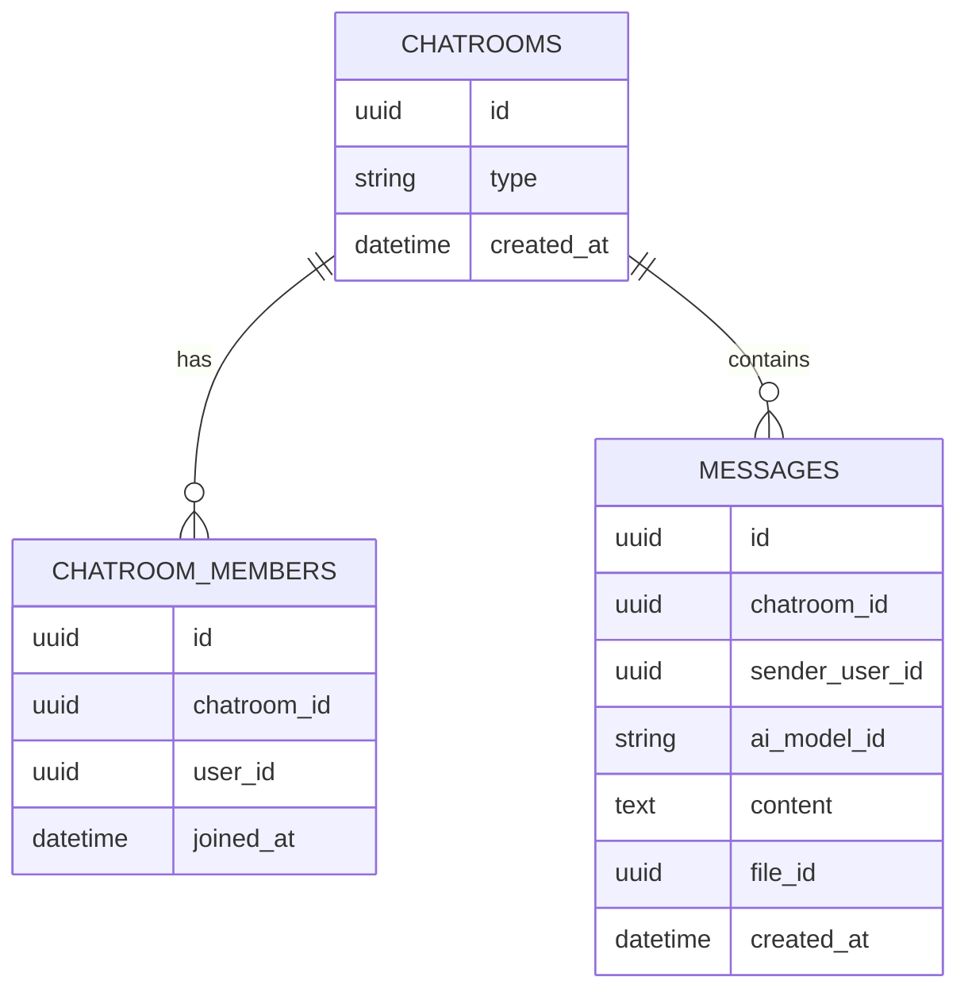
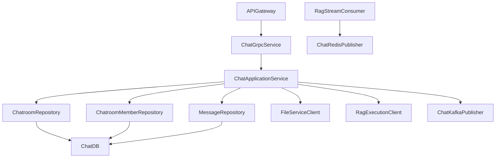
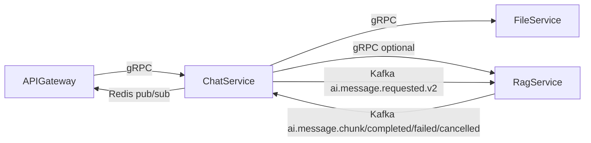

# Chat Service

## Overview
Chat Service owns conversational state for direct and AI-enabled chatrooms. It persists room/message history, handles typing and realtime fan-out hooks, and coordinates AI generation requests.

## Responsibilities
- Create and manage chatrooms and chatroom membership.
- Persist user and assistant message records.
- Support typing indicators and paginated message/chatroom listings.
- Trigger AI generation via Kafka and optional direct RAG gRPC path.
- Consume RAG output events and republish them to Redis channels for gateway streaming.
- Upload inline file attachments through file-service.

## Architecture
- Transport layer: `ChatGrpcService` implementing `ChatService` RPCs.
- Application layer: `ChatApplicationService` with chatroom resolution, authorization, and orchestration logic.
- Persistence layer: JPA entities and repositories for `chatrooms`, `chatroom_members`, and `messages`.
- Integration layer:
  - `ChatKafkaPublisher` for request/cancel events.
  - `RagStreamConsumer` for inbound AI stream topics.
  - `ChatRedisPublisher` for realtime user-facing events.
  - `FileServiceClient` and `RagExecutionClient` for gRPC integrations.

## API / gRPC Contracts
### gRPC Service
From `proto/chat.proto`:
- `SendMessage(SendMessageRequest) returns (SendMessageResponse)`
- `GetChatroom(GetChatroomRequest) returns (ChatroomResponse)`
- `ListChatrooms(ListChatroomsRequest) returns (ListChatroomsResponse)`
- `ListMessages(ListMessagesRequest) returns (ListMessagesResponse)`
- `SendTypingIndicator(TypingIndicatorRequest) returns (SimpleResponse)`
- `StreamMessageResponse(StreamMessageRequest) returns (stream MessageChunk)`
- `CancelMessage(CancelMessageRequest) returns (SimpleResponse)`

### Referenced Contracts
- `proto/file.proto` for attachment upload and metadata lookup.
- `proto/rag.proto` for direct execution fallback path.

## Communication
- Inbound synchronous: gRPC from api-gateway.
- Outbound synchronous: gRPC to file-service and rag-service.
- Outbound asynchronous: Kafka publish for AI requested/cancelled events.
- Inbound asynchronous: Kafka consume for AI chunk/completed/failed/cancelled topics.
- Internal asynchronous: Redis publish for realtime fan-out.

## Data Layer
### Database Overview
- PostgreSQL database: `chat_service_db`.
- Migration strategy: Flyway SQL migration `V1__init_chat.sql`.
- Realtime cache/event bus: Redis.

### Entities
- `chatrooms`: chatroom identity and type (`DIRECT`, `AI`).
- `chatroom_members`: many-to-many membership relation.
- `messages`: message body, sender, optional model/file references.

### Relationships
- One `chatrooms` row has many `chatroom_members`.
- One `chatrooms` row has many `messages`.
- A user can belong to many chatrooms and contribute many messages.

### Database Diagram (MANDATORY)

## Key Workflows
1. Send message: resolve/create room -> optional file upload -> persist message -> publish Redis event -> enqueue AI request.
2. Stream AI response: consume RAG topic events -> map to chat event types -> publish Redis chunks/completion/failure.
3. Cancel generation: receive cancel RPC -> publish cancel topic -> downstream RAG worker halts execution.

## Service Architecture Diagram (MANDATORY)

## Inter-Service Communication Diagram (MANDATORY)

## Environment Variables
| Name | Purpose | Required |
| --- | --- | --- |
| `SERVER_PORT` | Spring HTTP/management port | No |
| `GRPC_SERVER_PORT` | gRPC server port | Yes |
| `SPRING_DATASOURCE_URL` | PostgreSQL JDBC URL | Yes |
| `SPRING_DATASOURCE_USERNAME` | PostgreSQL username | Yes |
| `SPRING_DATASOURCE_PASSWORD` | PostgreSQL password | Yes |
| `SPRING_KAFKA_BOOTSTRAP_SERVERS` | Kafka brokers | Yes |
| `SPRING_DATA_REDIS_HOST` | Redis host for realtime channels | Yes |
| `SPRING_DATA_REDIS_PORT` | Redis port | Yes |
| `GRPC_FILE_ADDRESS` | file-service gRPC target | Yes |
| `GRPC_RAG_ADDRESS` | rag-service gRPC target | Yes |
| `APP_AI_TRANSPORT` | AI dispatch mode (`kafka`, `grpc`, `dual`) | No |
| `APP_GRPC_CHAT_SERVICE_SECRET` | Internal chat service secret | Yes |
| `APP_GRPC_FILE_SERVICE_SECRET` | Internal file service secret | Yes |
| `APP_GRPC_RAG_SERVICE_SECRET` | Internal rag service secret | Yes |
| `APP_KAFKA_TOPIC_AI_MESSAGE_V2` | AI request topic | Yes |
| `APP_KAFKA_TOPIC_AI_MESSAGE_CHUNK` | AI chunk topic | Yes |
| `APP_KAFKA_TOPIC_AI_MESSAGE_COMPLETED` | AI completion topic | Yes |
| `APP_KAFKA_TOPIC_AI_MESSAGE_FAILED` | AI failure topic | Yes |
| `APP_KAFKA_TOPIC_AI_MESSAGE_CANCELLED` | AI cancellation topic | Yes |

## Running the Service
- Docker: `docker compose up chat-service chat-postgres redis kafka file-service rag-service`.
- Local: `mvn -f chat-service/pom.xml spring-boot:run`.

## Scaling & Reliability Considerations
- Message and membership persistence is strongly consistent in PostgreSQL; stream delivery is eventually consistent.
- Kafka consumer group scaling allows parallel AI stream event handling.
- Redis fan-out decouples gateway connections from internal chat processing.
- Configure retry/backoff for file-service and rag-service gRPC calls to protect chat latency.
