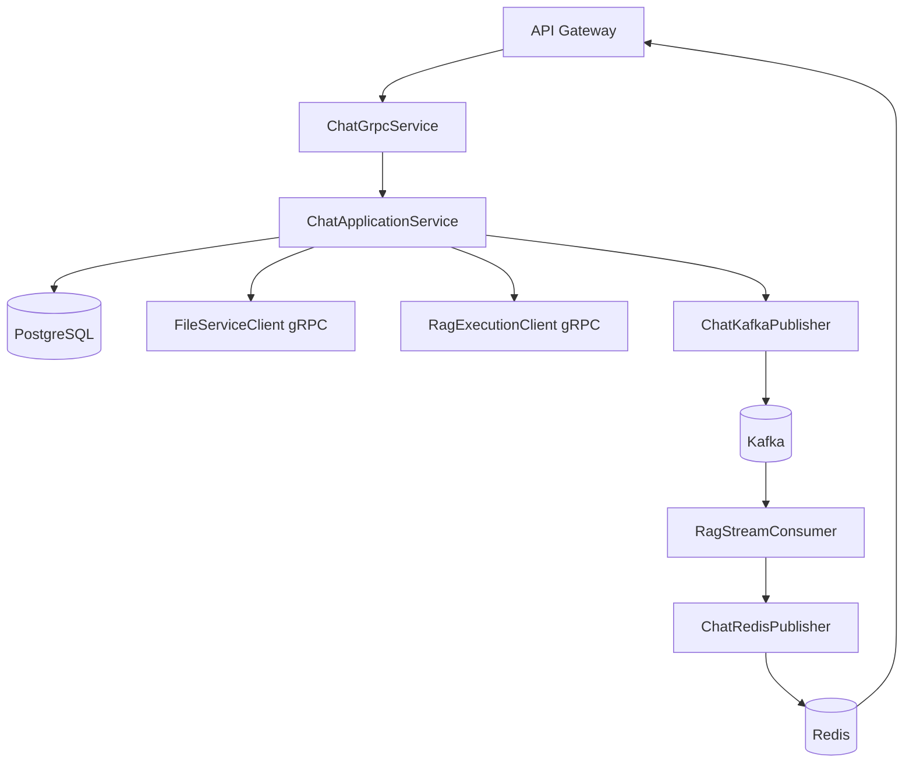

# Chat Service

## Overview
The Chat Service owns direct and AI chatroom state, message persistence, typing indicators, and AI request coordination. It exposes a gRPC contract for chat operations and bridges realtime updates through Redis and Kafka.

## Responsibilities
- Create and manage chatrooms (direct and AI).
- Persist chat messages and enforce membership access checks.
- Handle typing indicators and message listing.
- Forward AI generation requests to Kafka and/or RAG gRPC.
- Consume RAG streaming events from Kafka and republish to Redis channels.
- Upload inline chat file attachments through file-service gRPC.

## Architecture
Spring Boot service with clear transport/application/integration boundaries.

- gRPC transport:
  - `ChatGrpcService` implements `ChatService` methods from `proto/chat.proto`.
- Application layer:
  - `ChatApplicationService` manages chatroom resolution, membership validation, message save, and AI dispatch strategy.
- Persistence layer:
  - JPA entities for `chatrooms`, `chatroom_members`, and `messages`.
- Integration layer:
  - `ChatKafkaPublisher` publishes AI request/cancel events.
  - `RagStreamConsumer` consumes AI stream events and relays to Redis.
  - `ChatRedisPublisher` emits user-facing realtime events.
  - `FileServiceClient` uploads raw attachment bytes.
  - `RagExecutionClient` can call RAG directly over gRPC.

## API / gRPC Contracts
### Exposed gRPC service
From `proto/chat.proto`:
- `SendMessage`
- `GetChatroom`
- `ListChatrooms`
- `ListMessages`
- `SendTypingIndicator`
- `StreamMessageResponse` (contract placeholder; SSE bridge handled at gateway)
- `CancelMessage`

### Related contracts used
- `proto/file.proto` for file upload during message send.
- `proto/rag.proto` for direct execution fallback/dual mode.

## Data Layer
- Database: PostgreSQL (`chat_service_db`).
- Migration tool: Flyway.
- Core tables:
  - `chatrooms`: chatroom metadata and type (`DIRECT`, `AI`).
  - `chatroom_members`: membership relation by chatroom/user.
  - `messages`: persisted message content, sender, optional AI model id and file id.
- In-memory/realtime storage:
  - Redis pub/sub channels for new message, typing, and AI lifecycle events.

## Communication
- Sync:
  - gRPC server consumed by `api-gateway`.
  - gRPC clients to `file-service` and `rag-service`.
- Async:
  - Produces `ai.message.requested.v2` and cancellation events to Kafka.
  - Consumes `ai.message.chunk.v2`, `ai.message.completed.v2`, `ai.message.failed.v2`, `ai.message.cancelled.v2`.
  - Republishes consumed stream events to Redis for gateway SSE/WebSocket fanout.

## Key Workflows
1. Send message
   - Resolve or create direct/AI chatroom.
   - Optionally upload raw file content to file-service.
   - Persist message to DB.
   - Publish realtime message event to Redis.
   - Dispatch AI request via Kafka and optionally direct gRPC to RAG based on transport mode.
2. AI stream fanout
   - `RagStreamConsumer` receives chunk/completed/failed/cancelled Kafka events.
   - Events are converted and published to Redis channels (`aiChunk.*`, `aiCompleted.*`, etc).
   - Gateway subscribers stream updates to clients.
3. Access control
   - Membership checks run on chatroom and message list requests.
   - Unauthorized access raises gRPC errors mapped to transport status.

## Diagram

