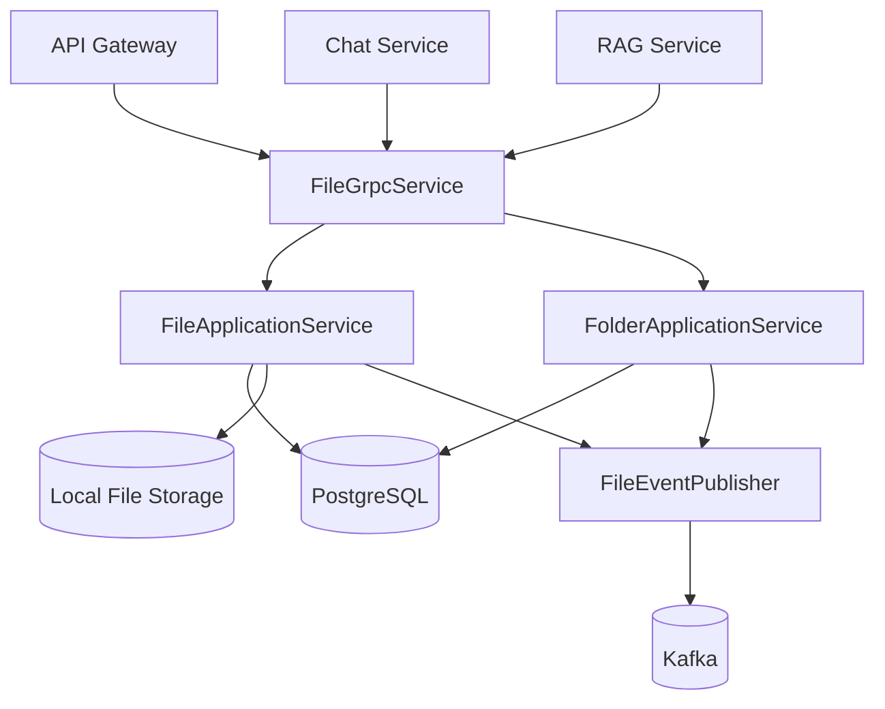

# File Service

## Overview
The File Service manages file and folder metadata, physical file storage, ownership/sharing rules, and RAG authorization support. It exposes a gRPC contract used by gateway, chat-service, and rag-service.

## Responsibilities
- Upload and stream file content.
- Manage folder lifecycle and folder sharing.
- Manage file metadata, soft delete, and file sharing.
- Enforce access rules for owner and shared users.
- Maintain physical storage paths and chunked upload/download behavior.
- Publish file/folder lifecycle events to Kafka (when enabled).
- Provide RAG-specific authorization and metadata batch RPCs.

## Architecture
Spring Boot gRPC service with application services for files and folders.

- gRPC transport:
  - `FileGrpcService` implements `FileService` from `proto/file.proto`.
- Application layer:
  - `FileApplicationService` handles upload, metadata, sharing, and content read/stream.
  - `FolderApplicationService` handles folder CRUD/share and folder access policies.
- Persistence layer:
  - JPA repositories for files, folders, file_shares, folder_shares.
- Storage layer:
  - Local filesystem under configurable root path (default `/data`).
- Event layer:
  - `FileEventPublisher` publishes upload/delete/folder events to Kafka topics.

## API / gRPC Contracts
### Exposed gRPC service
From `proto/file.proto`:
- Folder RPCs: `CreateFolder`, `UpdateFolder`, `DeleteFolder`, `ShareFolder`, `UnshareFolder`, `ListMyFolders`, `ListSharedFolders`
- File RPCs: `UploadFile`, `UploadFileStream`, `GetFileMetadata`, `DeleteFile`, `ShareFile`, `UnshareFile`, `UpdateFileMetadata`, `ListMyFiles`, `ListSharedWithMe`, `GetFilePath`, `GetFileContent`, `GetFileContentStream`
- RAG RPCs: `AuthorizeFilesForUser`, `BatchGetFileMetadata`

## Data Layer
- Database: PostgreSQL (`file_service_db`).
- Migration tool: Flyway.
- Core tables:
  - `files`: owner, folder, type, storage path, shareable/deleted flags.
  - `file_shares`: per-file share mappings.
  - `folders`: owner-scoped folder namespace.
  - `folder_shares`: per-folder share mappings.
- Physical storage:
  - Content persisted in filesystem paths generated per owner/folder/file.

## Communication
- Sync:
  - gRPC server consumed by `api-gateway`, `chat-service`, and `rag-service`.
- Async:
  - Publishes file and folder events to Kafka (`file.uploaded`, `file.deleted`, `folder.*`) when enabled.

## Key Workflows
1. Standard upload
   - Validate principal and folder access.
   - Persist content to temp file then atomically move to target path.
   - Save metadata row in `files`.
   - Emit upload event and metrics.
2. Streaming upload
   - Initialize upload session with first chunk metadata.
   - Enforce ordered chunks and max size constraints.
   - Append chunks incrementally, then finalize and persist metadata.
3. Access-controlled read
   - Resolve file metadata.
   - Verify owner or sharing relationship.
   - Return full content or streamed chunks.
4. RAG authorization
   - `AuthorizeFilesForUser` returns allowed file ids and deny reasons.
   - `BatchGetFileMetadata` returns metadata only for authorized files.

## Diagram

