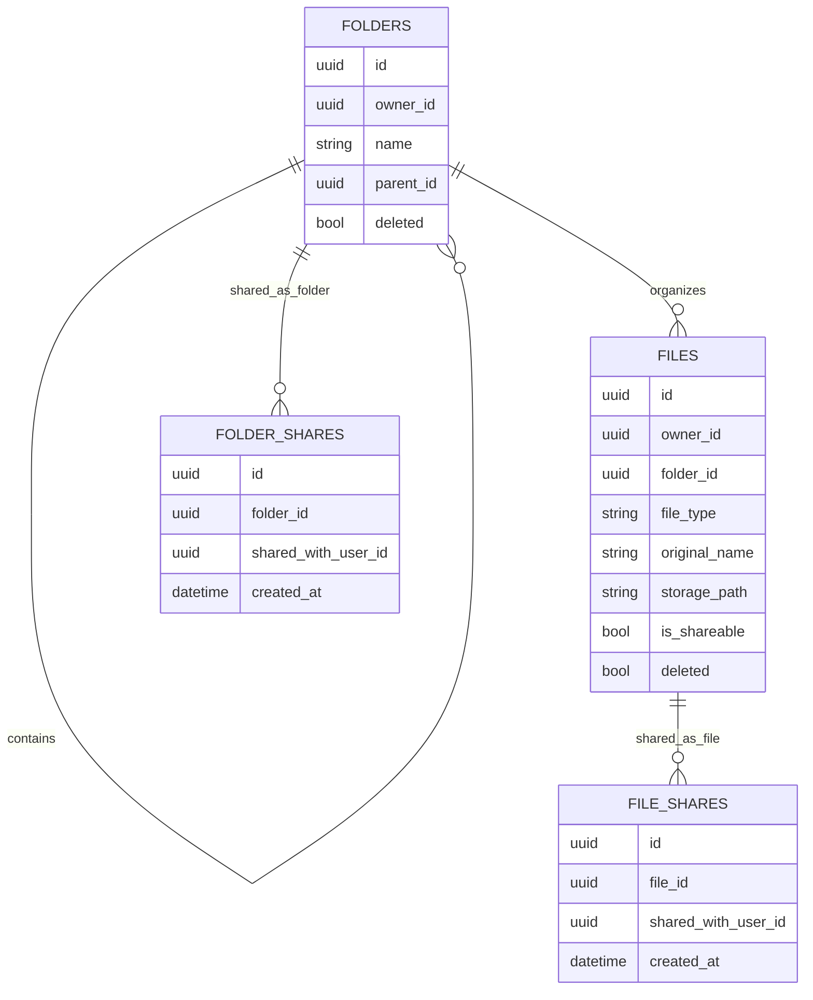
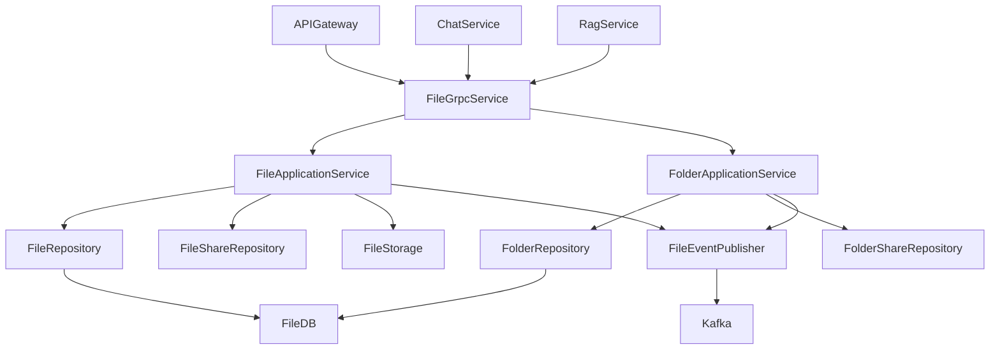
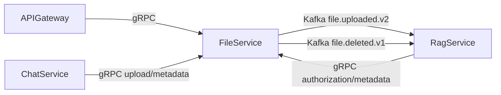

# File Service

## Overview
File Service owns file/folder metadata, physical file persistence, and sharing authorization. It is the authoritative source for file access checks used by chat and RAG flows.

## Responsibilities
- Manage folder and file lifecycle operations.
- Persist and stream binary content.
- Enforce owner/shared access control rules.
- Maintain folder/file share mappings.
- Publish file and folder lifecycle events for downstream processors.
- Provide RAG authorization and metadata batch lookup RPCs.

## Architecture
- Transport layer: `FileGrpcService` implementing `FileService` RPCs.
- Application layer: `FileApplicationService` and `FolderApplicationService`.
- Persistence layer: JPA repositories for files, folders, file shares, folder shares.
- Storage layer: local filesystem rooted at configurable `FILE_STORAGE_ROOT_PATH`.
- Integration layer: Kafka producer in `FileEventPublisher`.

## API / gRPC Contracts
### gRPC Service
From `proto/file.proto`:
- Folder RPCs: `CreateFolder`, `UpdateFolder`, `DeleteFolder`, `ShareFolder`, `UnshareFolder`, `ListMyFolders`, `ListSharedFolders`.
- File RPCs: `UploadFile`, `UploadFileStream`, `GetFileMetadata`, `DeleteFile`, `ShareFile`, `UnshareFile`, `UpdateFileMetadata`, `ListMyFiles`, `ListSharedWithMe`, `GetFilePath`, `GetFileContent`, `GetFileContentStream`.
- RAG-support RPCs: `AuthorizeFilesForUser`, `BatchGetFileMetadata`.

### Referenced Contracts
- `proto/file.proto` for all request/response schema definitions.

## Communication
- Inbound synchronous: gRPC from api-gateway, chat-service, and rag-service.
- Outbound asynchronous: Kafka topic publications for uploaded/deleted/folder lifecycle events.
- External dependency: local/shared filesystem volume for file bytes.

## Data Layer
### Database Overview
- PostgreSQL database: `file_service_db`.
- Migration strategy: Flyway (`V1__init.sql`, `V2__folders_and_file_folder_ref.sql`).
- Object storage abstraction: filesystem paths persisted in table metadata.

### Entities
- `files`: file metadata and storage coordinates.
- `folders`: owner-scoped hierarchical folders.
- `file_shares`: per-file access grants.
- `folder_shares`: per-folder access grants.

### Relationships
- One `folders` row has many `files` (`files.folder_id`).
- One `files` row has many `file_shares`.
- One `folders` row has many `folder_shares`.
- Folders can self-reference parent/child via `parent_id`.

### Database Diagram (MANDATORY)

## Key Workflows
1. Upload: validate ownership/folder rights -> write bytes to storage -> insert metadata -> publish upload event.
2. Streaming upload: validate chunk sequence and size -> append chunks -> finalize file metadata.
3. Read/preview: verify owner/share relationship -> return bytes or stream chunks.
4. RAG authorization: filter requested file IDs to allowed IDs and return deny reasons.

## Service Architecture Diagram (MANDATORY)

## Inter-Service Communication Diagram (MANDATORY)

## Environment Variables
| Name | Purpose | Required |
| --- | --- | --- |
| `SERVER_PORT` | Spring HTTP/management port | No |
| `GRPC_SERVER_PORT` | gRPC listener port | Yes |
| `SPRING_DATASOURCE_URL` | PostgreSQL JDBC URL | Yes |
| `SPRING_DATASOURCE_USERNAME` | PostgreSQL username | Yes |
| `SPRING_DATASOURCE_PASSWORD` | PostgreSQL password | Yes |
| `SPRING_KAFKA_BOOTSTRAP_SERVERS` | Kafka brokers | Yes |
| `FILE_STORAGE_ROOT_PATH` | Root directory for physical file storage | Yes |
| `FILE_STORAGE_MAX_SIZE_MB` | Max allowed file size | No |
| `FILE_STORAGE_CHUNK_SIZE_BYTES` | Chunk size for stream upload/download | No |
| `APP_GRPC_FILE_SERVICE_SECRET` | Shared service secret metadata | Yes |
| `APP_KAFKA_FILE_EVENTS_ENABLED` | Toggle file/folder event publishing | No |
| `APP_KAFKA_TOPIC_FILE_UPLOADED` | Legacy upload topic | No |
| `APP_KAFKA_TOPIC_FILE_UPLOADED_V2` | Primary upload topic | Yes |
| `APP_KAFKA_TOPIC_FILE_DELETED` | File delete topic | Yes |

## Running the Service
- Docker: `docker compose up file-service file-postgres kafka`.
- Local: `mvn -f file-service/pom.xml spring-boot:run`.

## Scaling & Reliability Considerations
- Metadata and sharing rules are durable in PostgreSQL; binaries are independent on shared storage volume.
- Event publication can be toggled, enabling isolated deployments without Kafka.
- Chunked upload supports large files without loading full payloads in memory.
- Add virus scanning and content-hash deduplication for production hardening.
