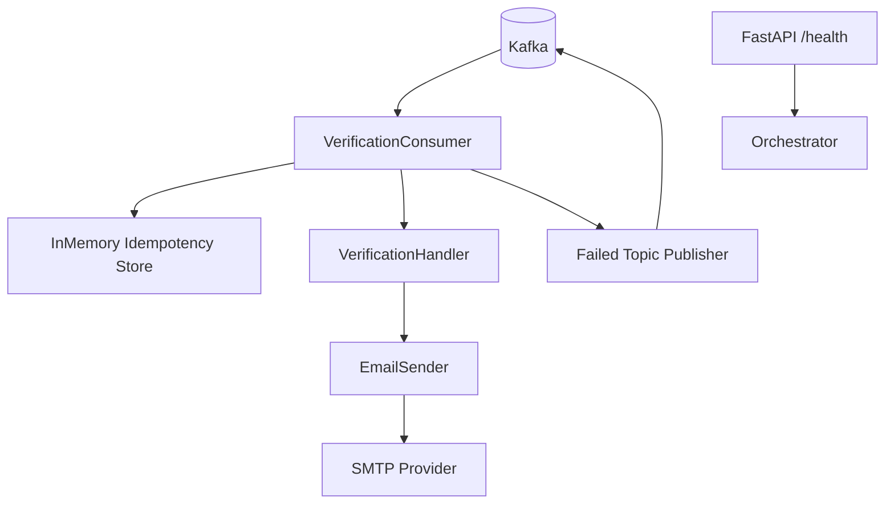

# Notification Service

## Overview
The Notification Service is an asynchronous email delivery worker exposed as a lightweight FastAPI app. Its main role is to consume verification-email events from Kafka and send transactional emails through SMTP with retry and dead-letter handling.

## Responsibilities
- Consume verification email events from Kafka.
- Enforce idempotent processing by event id.
- Send templated verification emails via SMTP.
- Retry transient email send failures with exponential backoff.
- Publish failed messages to a dead-letter Kafka topic.
- Expose health endpoint for orchestration and monitoring.

## Architecture
FastAPI process with startup-managed background consumer thread.

- API layer:
  - `app/main.py` creates FastAPI app and health endpoint.
- Config layer:
  - `app/config.py` loads settings from env using pydantic settings aliases.
- Consumer layer:
  - `VerificationConsumer` manages Kafka consumer loop, parsing, idempotency, and DLT publishing.
- Handler layer:
  - `VerificationHandler` validates payload and orchestrates sending.
- Email layer:
  - `EmailSender` renders HTML/text templates and sends mail over TLS SMTP.
- Utility layer:
  - In-memory idempotency store and retry helpers.

## API / gRPC Contracts
### Exposed API
- `GET /health` returns service status.

### Event contract consumed
- Kafka topic: `user.email.verification.v1` (configurable).
- Expected payload fields include event id, user id, email, username, verification code.

### Event contract produced
- Dead-letter topic: `notification.email.failed.v1` for failed processing.

## Data Layer
- Database: none.
- State handling:
  - In-memory idempotency cache with TTL to avoid duplicate sends within process lifetime.

## Communication
- Sync:
  - SMTP to external email provider (default Gmail SMTP settings).
- Async:
  - Kafka consume from verification topic.
  - Kafka produce to failed-notification dead-letter topic.

## Key Workflows
1. Consumer startup
   - FastAPI startup event creates and starts `VerificationConsumer`.
   - Required topics are checked/created.
2. Verification email processing
   - Consume event and parse payload.
   - Validate required fields and check idempotency.
   - Send email with retry policy.
   - Mark event as processed.
3. Failure path
   - On send/processing failure, publish payload + error metadata to dead-letter topic.

## Diagram

