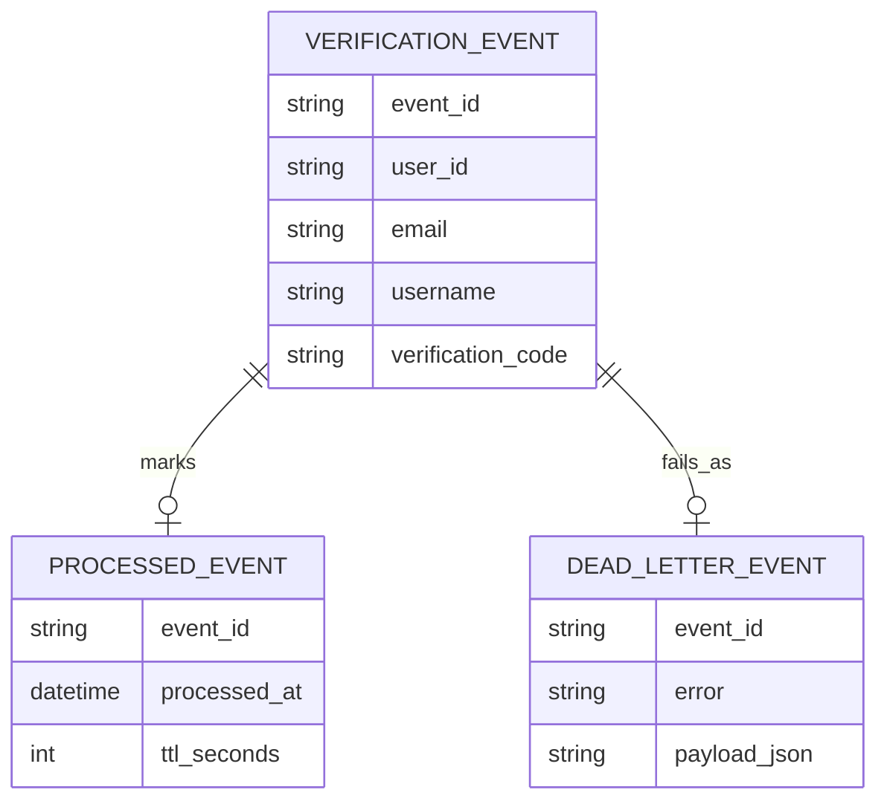
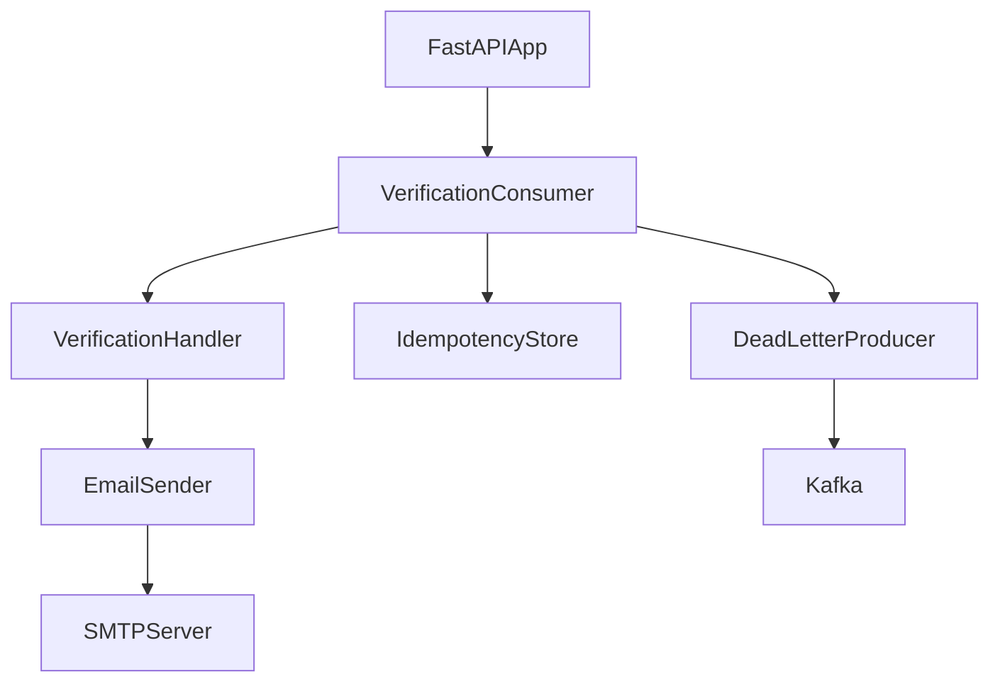
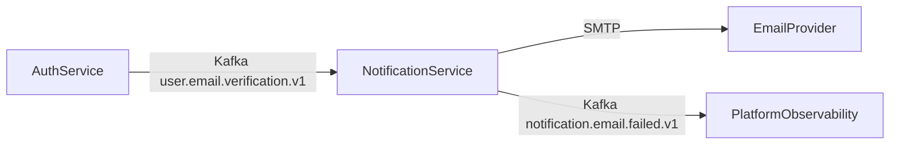

# Notification Service

## Overview
Notification Service is an event-driven email delivery worker. It consumes verification events from Kafka, sends email via SMTP, and emits dead-letter events for failures.

## Responsibilities
- Consume `user.email.verification.v1` events.
- Validate event payload and enforce idempotent handling.
- Render and send verification emails through SMTP.
- Retry transient delivery failures.
- Publish failed events to `notification.email.failed.v1`.
- Expose health endpoint for runtime checks.

## Architecture
- API layer: FastAPI app with lifecycle hooks in `app/main.py`.
- Config layer: Pydantic settings in `app/config.py`.
- Consumer layer: `VerificationConsumer` running in a managed background thread.
- Handler layer: `VerificationHandler` for payload validation and orchestration.
- Delivery layer: `EmailSender` with HTML template rendering and SMTP send.
- Utility layer: in-memory idempotency store and retry helper utilities.

## API / gRPC Contracts
### HTTP API
- `GET /health` returns service health status.

### Event Contracts
- Consumes: `user.email.verification.v1` (JSON payload with eventId, userId, email, username, verificationCode).
- Produces: `notification.email.failed.v1` (dead-letter payload with error and original event).

## Communication
- Inbound asynchronous: Kafka consume verification events.
- Outbound asynchronous: Kafka publish dead-letter events.
- Outbound synchronous: SMTP send to external mail provider.

## Data Layer
### Database Overview
This service has no persistent database. Runtime state is process-local.

### Entities
- `verification_event`: parsed incoming notification request.
- `processed_event`: idempotency marker with TTL.
- `dead_letter_event`: failed processing envelope.

### Relationships
- One `verification_event` may generate one `processed_event` marker.
- One failed `verification_event` generates one `dead_letter_event`.

### Database Diagram (MANDATORY)

## Key Workflows
1. Startup: FastAPI boot -> construct consumer -> ensure topics -> start polling loop.
2. Process event: parse payload -> validate required fields -> idempotency check -> send email -> mark processed.
3. Failure path: capture exception -> publish dead-letter event with correlation metadata.

## Service Architecture Diagram (MANDATORY)

## Inter-Service Communication Diagram (MANDATORY)

## Environment Variables
| Name | Purpose | Required |
| --- | --- | --- |
| `kafka_bootstrap_servers` / `KAFKA_BOOTSTRAP_SERVERS` | Kafka broker list | Yes |
| `kafka_group_id` / `KAFKA_GROUP_ID` | Kafka consumer group id | Yes |
| `kafka_topic_email_verification` | Verification topic name | Yes |
| `kafka_topic_email_failed` | Dead-letter topic name | Yes |
| `smtp_host` / `SMTP_HOST` | SMTP host | Yes |
| `smtp_port` | SMTP port | Yes |
| `smtp_username` / `SMTP_USERNAME` | SMTP auth username | Yes |
| `smtp_password` / `SMTP_PASSWORD` | SMTP auth password | Yes |
| `smtp_from` / `SMTP_FROM` | Sender email address | Yes |
| `idempotency_ttl_seconds` | TTL for processed-event cache | No |
| `consumer_poll_timeout_seconds` | Poll timeout for consumer loop | No |

## Running the Service
- Docker: `docker compose up notification-service kafka`.
- Local: `pip install -r notification-service/requirements.txt && uvicorn app.main:app --host 0.0.0.0 --port 8086` (run inside `notification-service`).

## Scaling & Reliability Considerations
- Current idempotency cache is in-memory; duplicates can occur across replicas after restarts.
- For multi-replica operation, move idempotency keys to Redis/PostgreSQL.
- Configure SMTP retry/backoff and DLT retention aligned with incident response objectives.
- Kafka topic partitioning can scale consume throughput for high-volume notification campaigns.
