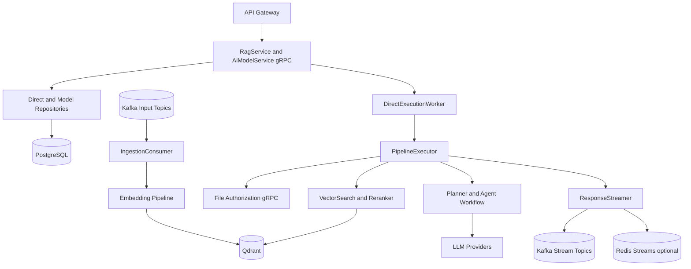

# RAG Service

## Overview
The RAG Service is the AI orchestration core of the platform. It handles retrieval-augmented execution, direct AI execution lifecycle, model/provider management, file ingestion into vector storage, and stream-oriented response publishing for chat experiences.

## Responsibilities
- Expose gRPC APIs for RAG operations and AI model/provider management.
- Ingest file content into embeddings and store vectors in Qdrant.
- Execute AI pipelines with file authorization, retrieval, reranking, agent orchestration, and aggregation.
- Manage direct execution state (accepted, running, completed, failed, cancelled).
- Persist chatrooms, messages, and execution metadata in PostgreSQL.
- Publish AI chunk/completion/failure/cancellation events to Kafka and/or Redis streams.
- Consume ingestion and AI request events from Kafka.

## Architecture
The service is a FastAPI application with startup lifespan hooks and background workers.

- Entrypoint and lifecycle:
    - `app/main.py` initializes Qdrant, DB schema, producer, gRPC server, and background workers.
- gRPC server:
    - `app/grpc/ai_models_server.py` hosts both `AiModelService` and `RagService` implementations.
- Ingestion pipeline:
    - `app/ingestion/kafka_consumer.py` consumes file and AI request topics.
    - `file_loader -> extractor -> chunker -> embedding_pipeline` generates vectors.
- Orchestration pipeline:
    - `app/orchestration/pipeline_executor.py` performs permission check, retrieval, rerank, planning, agent execution, aggregation, and streaming.
- LLM provider runtime:
    - Provider implementations under `app/llm/` (OpenAI, Gemini, Groq, DeepSeek, OpenRouter, local).
- Streaming layer:
    - `app/streaming/response_streamer.py` writes to Kafka and/or Redis stream sinks.
- Persistence layer:
    - SQLAlchemy async models/repositories in `app/models/` and `app/repositories/`.

## API / gRPC Contracts
### Exposed gRPC services
From `proto/rag.proto`:
- Retrieval and ingestion: `IngestFile`, `RetrieveChunks`, `DeleteFileVectors`
- Generation control: `ExecuteDirect`, `GetExecution`, `CancelExecution`, `CancelGeneration`, `GetExecutionStreamBootstrap`
- Chatroom APIs: `ListChatrooms`, `GetChatroom`, `ListChatroomMessages`, `UpdateChatroomTitle`, `DeleteChatroom`
- Ops/discovery: `ListProviders`, `CollectionInfo`

From `proto/ai_models.proto`:
- `ListModels`
- `CreateModelDefinition`
- `AttachProviderToModel`
- `CreateProviderAccount`
- `ListProviders`
- `ListAccounts`

### Exposed HTTP endpoints
- `GET /health`
- `GET /ready`

### Related contracts used
- Calls `proto/file.proto` authorization RPC from `UserPermissionChecker`.

## Data Layer
- Relational DB: PostgreSQL (`rag_db`) via SQLAlchemy async.
- Vector DB: Qdrant collection (default `rag_chunks_dev` / runtime-configurable).

### PostgreSQL entities
- Direct AI/chat state:
    - `chat_rooms`
    - `messages`
    - `ai_executions`
- Model orchestration state:
    - `model_definitions`
    - `model_providers`
    - `provider_accounts`
    - `model_endpoints`
- Legacy compatibility model:
    - `ai_models`

### Key relationships
- `messages.chatroom_id -> chat_rooms.id`
- `ai_executions.chatroom_id -> chat_rooms.id`
- `ai_executions.message_id -> messages.id`
- `model_providers.model_definition_id -> model_definitions.id`
- `model_endpoints.model_provider_id -> model_providers.id`
- `model_endpoints.provider_account_id -> provider_accounts.id`

## Communication
- Sync:
    - gRPC server consumed by `api-gateway` and internal callers.
    - gRPC client calls to file-service for `AuthorizeFilesForUser`.
- Async consume:
    - Kafka topics: file uploaded/deleted, AI requested/cancelled.
- Async produce:
    - AI stream topics: chunk/completed/failed/cancelled.
    - Optional Redis stream sink for stream bootstrap/resume flow.
- External integrations:
    - Qdrant (vector search storage).
    - HF TEI endpoint for embedding generation.
    - LLM providers: OpenAI, Gemini, Groq, DeepSeek, OpenRouter, optional local endpoint.

## Key Workflows
1. File ingestion workflow
     - Consume `file.uploaded.v2`.
     - Load file from shared storage path.
     - Extract text by content type.
     - Chunk text and embed through TEI.
     - Upsert deterministic chunk vectors into Qdrant.
2. Direct execution workflow
     - Gateway calls `ExecuteDirect`.
     - Service validates metadata and request payload.
     - Resolve/create chatroom and create user+assistant messages.
     - Persist execution record and enqueue background worker job.
     - Worker runs pipeline and updates execution/message states.
3. Pipeline execution workflow
     - Authorize file ids via file-service.
     - Retrieve candidate chunks from Qdrant and rerank.
     - Build plan and execute specialized agents.
     - Aggregate output and stream chunk events.
     - Persist final content and publish completion event with usage metadata.
4. Cancellation workflow
     - Receive cancellation via gRPC or Kafka event.
     - Set cancellation signal in executor registry.
     - Publish cancelled event and mark execution state accordingly.

## Diagram
