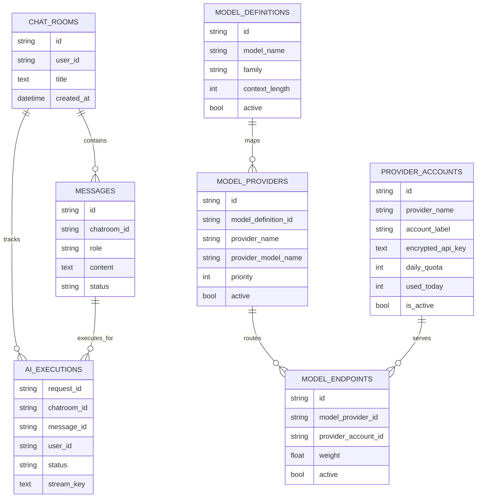
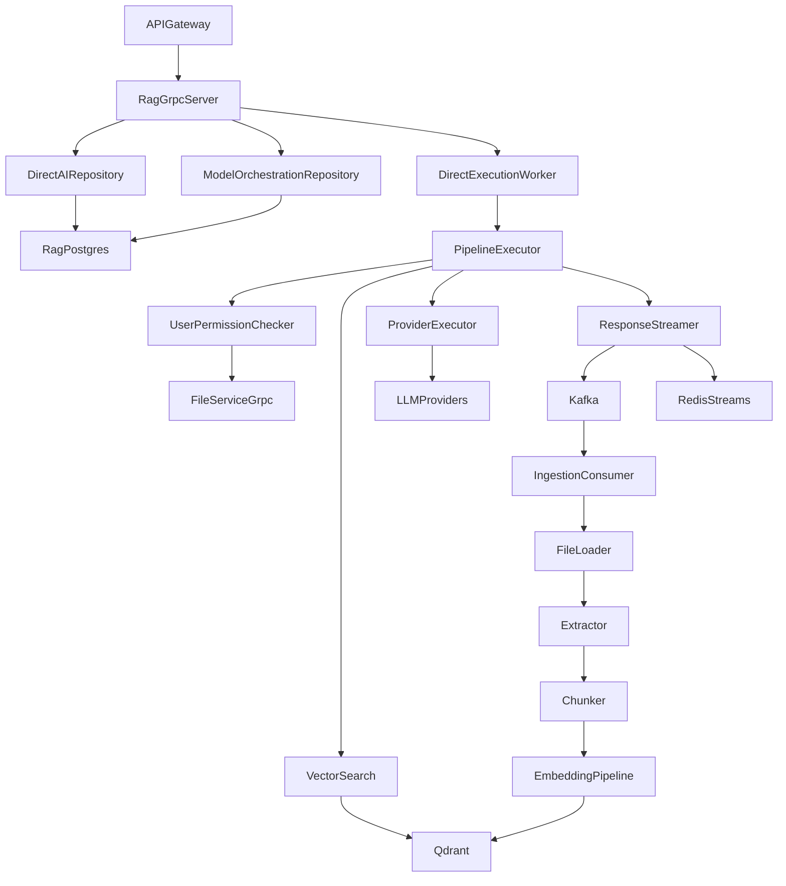
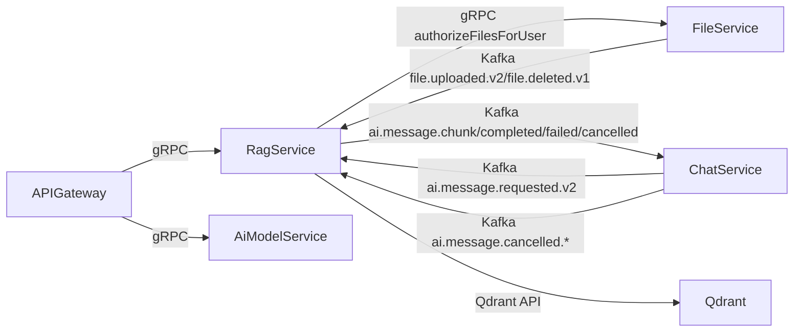

# RAG Service

## Overview
RAG Service is the AI orchestration and retrieval engine for the platform. It ingests uploaded files into vector storage, executes generation workflows, persists execution state, and streams AI outputs back to chat channels.

## Responsibilities
- Expose `RagService` and `AiModelService` gRPC APIs.
- Consume ingestion and AI request events from Kafka.
- Build embeddings and persist vectors in Qdrant.
- Execute retrieval and multi-step generation pipelines.
- Persist chat room/message/execution metadata in PostgreSQL.
- Publish AI output chunks, completion, failure, and cancellation events.
- Manage provider routing, account pools, and model-provider mappings.

## Architecture
- API/runtime layer: FastAPI app with startup lifespan and health/readiness probes.
- gRPC layer: `AiModelsGrpcServer` serving both `RagService` and `AiModelService`.
- Ingestion layer: file loader, extractor, chunker, embedding pipeline, and Kafka ingestion consumer.
- Orchestration layer: planner/workflow builder, pipeline executor, and response aggregation.
- Streaming layer: `ResponseStreamer` with Kafka and Redis stream sinks.
- Persistence layer: SQLAlchemy async models/repositories for execution and model-routing metadata.
- Integration layer: Qdrant, TEI embedding endpoint, and external LLM providers.

## API / gRPC Contracts
### gRPC Service: `proto/rag.proto`
- `IngestFile`
- `RetrieveChunks`
- `DeleteFileVectors`
- `CancelGeneration`
- `ExecuteDirect`
- `GetExecution`
- `CancelExecution`
- `GetExecutionStreamBootstrap`
- `ListChatrooms`
- `GetChatroom`
- `ListChatroomMessages`
- `UpdateChatroomTitle`
- `DeleteChatroom`
- `ListProviders`
- `CollectionInfo`

### gRPC Service: `proto/ai_models.proto`
- `ListModels`
- `CreateModelDefinition`
- `AttachProviderToModel`
- `CreateProviderAccount`
- `ListProviders`
- `ListAccounts`

### HTTP Endpoints
- `GET /health`
- `GET /ready`

### Referenced Contracts
- Calls `proto/file.proto` (`AuthorizeFilesForUser`) before retrieval/execution.

## Communication
- Inbound synchronous: gRPC from api-gateway and internal services.
- Outbound synchronous: gRPC authorization requests to file-service.
- Inbound asynchronous: Kafka consume (`file.uploaded.v2`, `file.deleted.v1`, `ai.message.requested.v2`, cancellation topic).
- Outbound asynchronous: Kafka publish (`ai.message.chunk.*`, `ai.message.completed.*`, `ai.message.failed.*`, `ai.message.cancelled.*`).
- Optional stream backend: Redis stream append for bootstrap/resume semantics.

## Data Layer
### Database Overview
- Relational store: PostgreSQL (`rag_db`) for execution and model orchestration state.
- Vector store: Qdrant collection (`QDRANT_COLLECTION`) for chunk embeddings.

### Entities
- Execution/chat entities: `chat_rooms`, `messages`, `ai_executions`.
- Model routing entities: `model_definitions`, `model_providers`, `provider_accounts`, `model_endpoints`.
- Legacy compatibility entity: `ai_models`.

### Relationships
- `chat_rooms` 1:N `messages`.
- `chat_rooms` 1:N `ai_executions`.
- `messages` 1:N `ai_executions` (execution references assistant message).
- `model_definitions` 1:N `model_providers`.
- `model_providers` 1:N `model_endpoints`.
- `provider_accounts` 1:N `model_endpoints`.

### Database Diagram (MANDATORY)

## Key Workflows
1. File ingestion pipeline: consume upload event -> load file from shared path -> extract/chunk/embed -> upsert vectors in Qdrant.
2. Direct execution pipeline: receive `ExecuteDirect` -> validate security context -> create chat+execution records -> enqueue worker.
3. Retrieval/generation pipeline: authorize file IDs -> vector search/rerank -> provider execution -> stream chunks -> persist final output.
4. Cancellation pipeline: accept cancel RPC/topic -> mark execution cancelled -> emit cancellation event.

## Service Architecture Diagram (MANDATORY)

## Inter-Service Communication Diagram (MANDATORY)

## Environment Variables
| Name | Purpose | Required |
| --- | --- | --- |
| `RAG_HOST` | FastAPI bind host | No |
| `RAG_PORT` | FastAPI bind port | Yes |
| `RAG_GRPC_HOST` | gRPC bind host | No |
| `RAG_GRPC_PORT` | gRPC bind port | Yes |
| `RAG_DATABASE_URL` | PostgreSQL connection string | Yes |
| `QDRANT_URL` | Qdrant endpoint | Yes |
| `QDRANT_COLLECTION` | Target vector collection | Yes |
| `QDRANT_VECTOR_SIZE` | Embedding dimension | Yes |
| `TEI_BASE_URL` | Embedding inference endpoint | Yes |
| `KAFKA_BOOTSTRAP_SERVERS` | Kafka broker list | Yes |
| `KAFKA_GROUP_ID` | Consumer group id | Yes |
| `KAFKA_TOPIC_FILE_UPLOADED_V2` | File uploaded ingestion topic | Yes |
| `KAFKA_TOPIC_FILE_DELETED_V1` | File deleted ingestion topic | Yes |
| `KAFKA_TOPIC_AI_MESSAGE_REQUESTED_V2` | AI execution request topic | Yes |
| `KAFKA_TOPIC_AI_MESSAGE_CHUNK_V2/V1` | AI stream chunk topic | Yes |
| `KAFKA_TOPIC_AI_MESSAGE_COMPLETED_V2/V1` | AI stream completion topic | Yes |
| `KAFKA_TOPIC_AI_MESSAGE_FAILED_V2/V1` | AI stream failure topic | Yes |
| `FILE_STORAGE_ROOT_PATH` | Read-only mounted file storage root | Yes |
| `GRPC_FILE_SERVICE_ADDRESS` | file-service gRPC endpoint | Yes |
| `APP_GRPC_SERVICE_SECRET` | Shared internal gRPC secret | Yes |
| `ENCRYPTION_KEY` | Encryption secret for runtime security operations | Yes |
| `STREAM_BACKEND` | Stream sink mode (`kafka`, `redis`, `dual`) | Yes |
| `REDIS_URL` | Redis endpoint for stream sink | Required when `STREAM_BACKEND` includes Redis |

## Running the Service
- Docker: `docker compose up rag-service rag-postgres qdrant tei kafka redis`.
- Local: `pip install -r rag-service/requirements.txt && uvicorn app.main:app --host 0.0.0.0 --port 8087` (run inside `rag-service`).

## Scaling & Reliability Considerations
- Scale worker and consumer throughput independently from gRPC request handling.
- Keep Qdrant and PostgreSQL backup/restore policies aligned with data retention goals.
- Use provider-account quotas and health signals to avoid overloaded external LLM endpoints.
- For production, enforce strict secret rotation and non-default encryption/service-secret values.