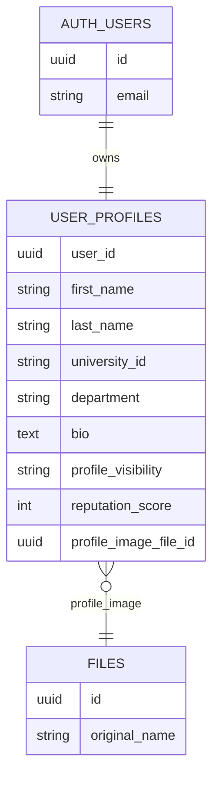
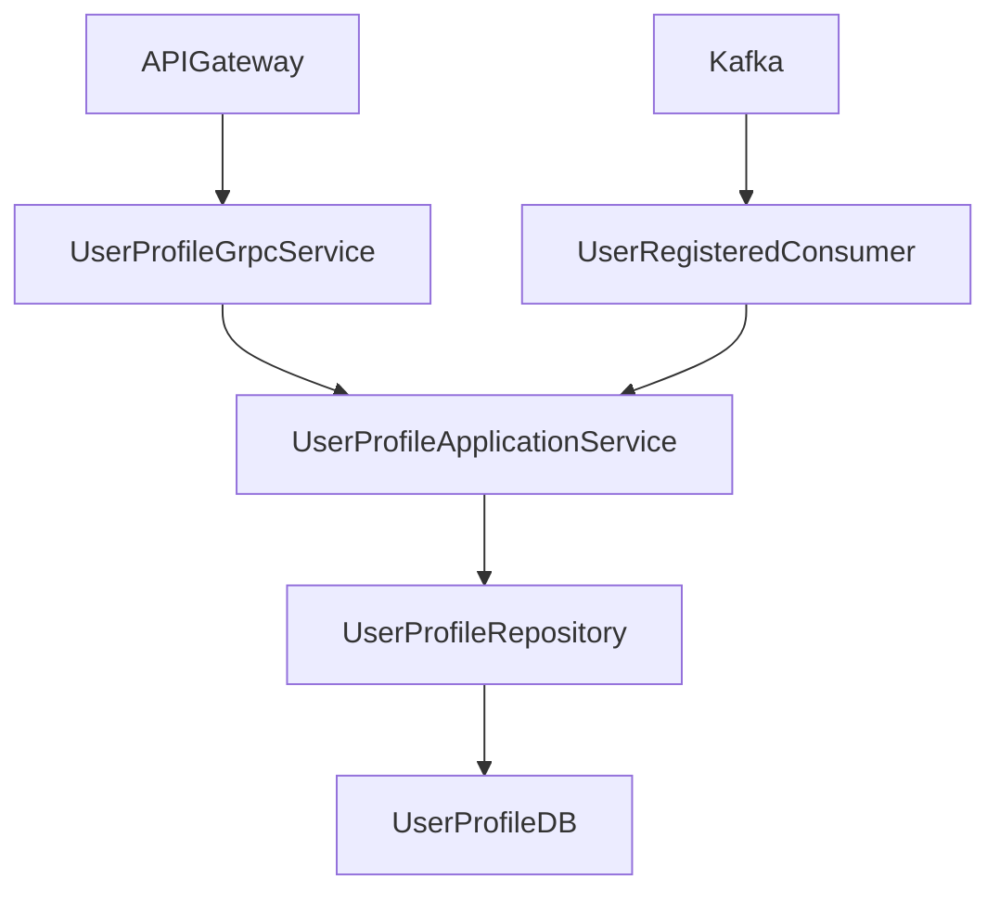
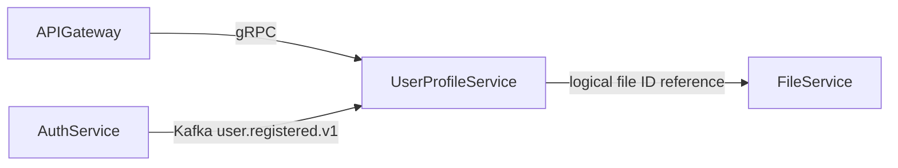

# User Profile Service

## Overview
User Profile Service manages user-facing profile metadata and privacy controls. It is a gRPC-first service and asynchronously initializes default profiles from registration events.

## Responsibilities
- Serve profile reads for self and other users.
- Update editable profile fields and profile image references.
- Enforce profile visibility policy (`PUBLIC`, `UNIVERSITY_ONLY`, `PRIVATE`).
- Provide filtered profile search.
- Maintain profile reputation score updates.
- Bootstrap profile rows on `user.registered.v1` events.

## Architecture
- Transport layer: `UserProfileGrpcService` implementing `UserProfileService`.
- Application layer: `UserProfileApplicationService` with visibility and update rules.
- Persistence layer: `UserProfileRepository` over PostgreSQL.
- Event ingestion layer: `UserRegisteredConsumer` with Kafka consumer configuration and DLT support.

## API / gRPC Contracts
### gRPC Service
From `proto/profile.proto`:
- `GetMyProfile(GetMyProfileRequest) returns (UserProfileResponse)`
- `GetProfileById(GetProfileRequest) returns (UserProfileResponse)`
- `UpdateMyProfile(UpdateProfileRequest) returns (UserProfileResponse)`
- `SearchProfiles(SearchProfilesRequest) returns (SearchProfilesResponse)`
- `UpdateProfileVisibility(UpdateVisibilityRequest) returns (SimpleResponse)`
- `IncrementReputation(IncrementReputationRequest) returns (SimpleResponse)`

### Referenced Contracts
- `proto/profile.proto` for all profile request/response DTOs and visibility enum.

## Communication
- Inbound synchronous: gRPC from api-gateway.
- Inbound asynchronous: Kafka consume of `user.registered.v1`.
- Outbound synchronous/asynchronous: none required in core path.

## Data Layer
### Database Overview
- PostgreSQL database: `user_profile_db`.
- Migration strategy: Flyway SQL migrations.

### Entities
- `user_profiles`: single profile row per user identity.

### Relationships
- Logical 1:1 with auth-service `users.id` via `user_id`.
- Logical optional reference to file-service file object via `profile_image_file_id`.

### Database Diagram (MANDATORY)

## Key Workflows
1. Profile bootstrap: consume `user.registered.v1` -> create default profile if absent.
2. Protected profile read: resolve target profile -> evaluate visibility against caller -> return or deny.
3. Profile update: validate authenticated principal -> persist updated fields.
4. Search: apply query filters and visibility filtering before response.

## Service Architecture Diagram (MANDATORY)

## Inter-Service Communication Diagram (MANDATORY)

## Environment Variables
| Name | Purpose | Required |
| --- | --- | --- |
| `SERVER_PORT` | Spring HTTP/management port | No |
| `GRPC_SERVER_PORT` | gRPC listener port | Yes |
| `SPRING_DATASOURCE_URL` | PostgreSQL JDBC URL | Yes |
| `SPRING_DATASOURCE_USERNAME` | PostgreSQL username | Yes |
| `SPRING_DATASOURCE_PASSWORD` | PostgreSQL password | Yes |
| `SPRING_KAFKA_BOOTSTRAP_SERVERS` | Kafka broker list | Yes |
| `APP_GRPC_PROFILE_SERVICE_SECRET` | Shared internal gRPC secret | Yes |
| `APP_KAFKA_TOPIC_USER_REGISTERED` | Registration bootstrap topic | Yes |
| `APP_KAFKA_TOPIC_USER_REGISTERED_DLT` | DLT for failed registration events | No |

## Running the Service
- Docker: `docker compose up user-profile-service profile-postgres kafka`.
- Local: `mvn -f user-profile-service/pom.xml spring-boot:run`.

## Scaling & Reliability Considerations
- Profile table is narrow and keyed by `user_id`, enabling predictable lookup performance.
- Kafka consumer can be scaled with partitions; idempotent create logic avoids duplicate profile rows.
- Visibility enforcement should remain centralized in application service to avoid policy drift.
- Search endpoints may require dedicated indexes for large datasets and fuzzy name queries.
